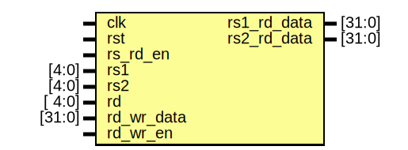

# Entity: regs 

- **File**: regs.sv
## Diagram

## Ports

| Port name   | Direction | Type   | Description                                |
| ----------- | --------- | ------ | ------------------------------------------ |
| clk         | input     |        |                                            |
| rst         | input     |        |                                            |
| rs_rd_en    | input     |        | source registers read enable               |
| rs1         | input     | [4:0]  | source register 1 address                  |
| rs2         | input     | [4:0]  | source register 2 address                  |
| rd          | input     | [ 4:0] | destination register address               |
| rd_wr_data  | input     | [31:0] | data to be written to destination register |
| rd_wr_en    | input     |        | destination register write enable          |
| rs1_rd_data | output    | [31:0] | source register 1 value                    |
| rs2_rd_data | output    | [31:0] | source register 2 value                    |
## Signals

| Name       | Type       | Description                                         |
| ---------- | ---------- | --------------------------------------------------- |
| x          | reg [31:0] | regs from x1 to x31 (x0 is hard-wired with 0 value) |
| r_rs1      | reg [4:0]  | registered rs1                                      |
| r_rs2      | reg [4:0]  |                                                     |
| need_write | wire       |                                                     |
| i          | integer    |                                                     |
## Processes
- sync_read_process: ( @(posedge clk, posedge rst) )
  - **Type:** always
- sync_write_process: ( @(posedge clk, posedge rst) )
  - **Type:** always
